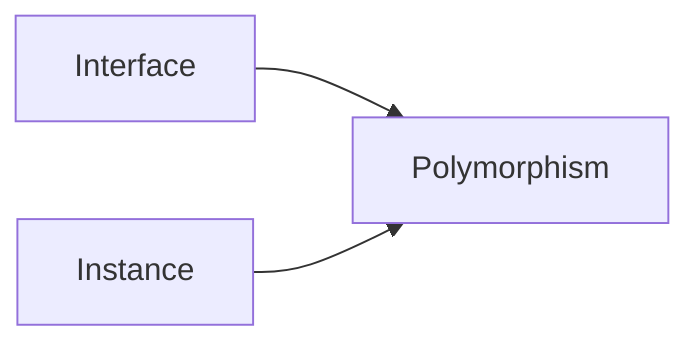

# Java Core: concepts

Kiến thức nền của Java, chưa dính framework.

```mermaid
flowchart LR
    I[Interface] --> P[Polymorphism]
    O[Instance] --> P
```

1. [Interface](interface.md): stub
2. [Instance](instance.md): stub
3. [Polymorphism](polymorphism.md)
